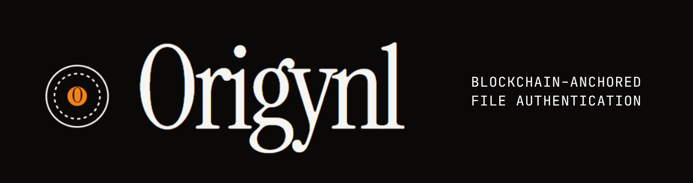

<p align="center">
  
</p>

<p align="center">
  <strong>Prove you made it first.</strong>
</p>

<p align="center">
  <a href="https://origynl.vercel.app"></a>
  <a href="https://amoy.polygonscan.com/address/0x894C98bf09B4e9e4FEd3612803920b7d82C59d41"></a>
  <a href="LICENSE"></a>
  <a href="https://buymeacoffee.com/zbrenner"></a>
</p>

<p align="center">
  Upload a file. Get an immutable, timestamped proof on the blockchain.<br/>
  The file never leaves your device. Only the hash goes on-chain.
</p>

---

## The Problem

AI-generated content is getting indistinguishable from the real thing. Deepfakes, synthetic writing, AI art — anyone can produce anything and claim they made it first. There's no reliable way to prove when a piece of original work existed.

**Origynl fixes this.** SHA-256 hash your file, record it on Polygon, and the blockchain timestamp becomes your evidence. It's not DRM. It's a notary.

---

## How It Works

<table>
<tr>
<td width="25%" align="center">

**Certify**

Upload an image or PDF. Origynl computes a SHA-256 hash and writes it to the OrigynlLedger smart contract on Polygon. The file stays on your device.

</td>
<td width="25%" align="center">

**Verify**

Drop in any document to check if it's been certified. If the hash exists on-chain, you get the timestamp and transaction record.

</td>
<td width="25%" align="center">

**Capture**

Take a live photo with embedded GPS, timestamp, and device metadata. Creates a "witness proof" tied to a blockchain-anchored hash.

</td>
<td width="25%" align="center">

**Watermark**

Certified images receive a visible watermark and embedded metadata proving certification status.

</td>
</tr>
</table>

---

## Try It

**Live at [origynl.vercel.app](https://origynl.vercel.app)** — certify a file in under 30 seconds.

Or run locally:

```bash
git clone https://github.com/foolish-bandit/Origynl.git
cd Origynl
npm install
npm run dev
```

> Blockchain writes require Vercel serverless functions. Local dev renders the UI but on-chain transactions need deployment. See [setup](#deploy) below.

---

## Use Cases

- **Artists & photographers** — timestamp your original work before publishing
- **Journalists** — create verifiable witness proofs with embedded location/time
- **Researchers** — prove when a dataset, paper, or finding was produced
- **Legal** — establish prior art or document existence at a specific time
- **Developers** — certify code snapshots, audit trails, or build artifacts
- **Anyone** — prove "I had this file at this time" with cryptographic certainty

---

## Tech Stack

| Layer | Tech |
|-------|------|
| Frontend | React 19, TypeScript, Tailwind CSS |
| Build | Vite 6 |
| Blockchain | Polygon Amoy via [viem](https://viem.sh) |
| Smart Contract | Solidity — [`OrigynlLedgerV2.sol`](contracts/src/OrigynlLedgerV2.sol) |
| Backend | Vercel Serverless Functions |
| Camera/EXIF | react-webcam, piexifjs |
| PDF | pdf-lib |

## Smart Contract

Deployed on Polygon Amoy at [`0x894C...9d41`](https://amoy.polygonscan.com/address/0x894C98bf09B4e9e4FEd3612803920b7d82C59d41)

The contract is simple by design: store a SHA-256 hash, record the sender and timestamp, emit an event. Immutable once written. See [`BLOCKCHAIN_INTEGRATION.md`](./BLOCKCHAIN_INTEGRATION.md) for contract architecture.

---

## Deploy

### Prerequisites

- Node.js v18+
- A Polygon wallet with testnet POL ([faucet](https://faucet.polygon.technology/))

### Vercel (recommended)

1. Fork this repo
2. Import into [Vercel](https://vercel.com)
3. Add environment variables:
   - `PRIVATE_KEY` — your Polygon wallet private key
   - `CONTRACT_ADDRESS` — `0x894C98bf09B4e9e4FEd3612803920b7d82C59d41`
4. Deploy

### Local Development

```bash
git clone https://github.com/foolish-bandit/Origynl.git
cd Origynl
npm install
cp .env.example .env.local
# Edit .env.local with your PRIVATE_KEY and CONTRACT_ADDRESS
npm run dev
```

---

## Roadmap

- [ ] Polygon mainnet deployment
- [ ] Batch certification via Merkle tree (V2 contract)
- [ ] WalletConnect self-custody mode (sign with your own wallet)
- [ ] C2PA Content Credentials for captured images
- [ ] PAdES-signed certificate PDFs
- [ ] OpenTimestamps dual anchor (Bitcoin + Polygon)
- [ ] Perceptual hash + steganographic watermark
- [ ] Public shareable `/proof/:id` verification page
- [ ] IPFS pinning for certified file backup
- [ ] PWA / offline capture with queued certification
- [ ] Mobile-native capture (Capacitor)

**Explicit non-goal:** Origynl does not and will not use AI for authenticity scoring. Provenance is established cryptographically, not inferred.

---

## Contributing

PRs welcome. The codebase is React + TypeScript + Vite — standard setup.

```bash
npm install
npm run dev      # dev server
npm run test     # run tests
npm run build    # production build
```

---

## License

MIT

<p align="center">
  <sub>Built by <a href="https://github.com/foolish-bandit">Zack Brenner</a></sub>
</p>
